# MoodMate App
Elevate your mental well-being with flutter and firebase-powerd app, offering 
personalized tools for managing stress, tracking mood, and accessing supportive 
resources

## Tech Used: 
      

## Installation

### Clone the project
```bash
git clone https://github.com/Linux-DEX/moodmate.git
```

### Install package
```bash
flutter pub get
```

> [!NOTE]
> Run the android emulator in your system

### Run the app
```bash
flutter run
```

## App images
   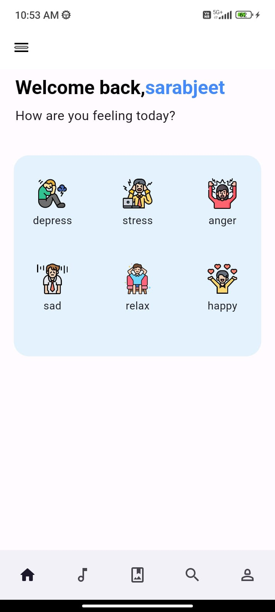 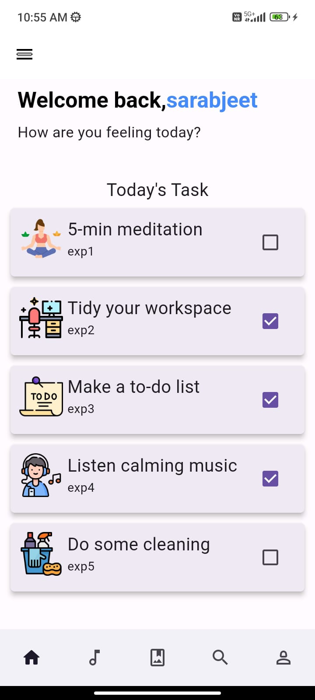 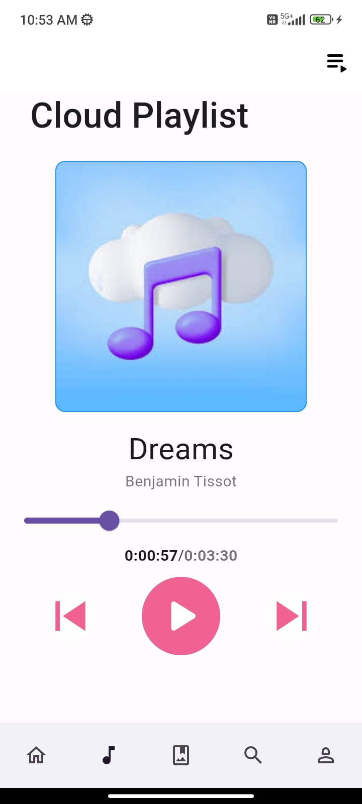 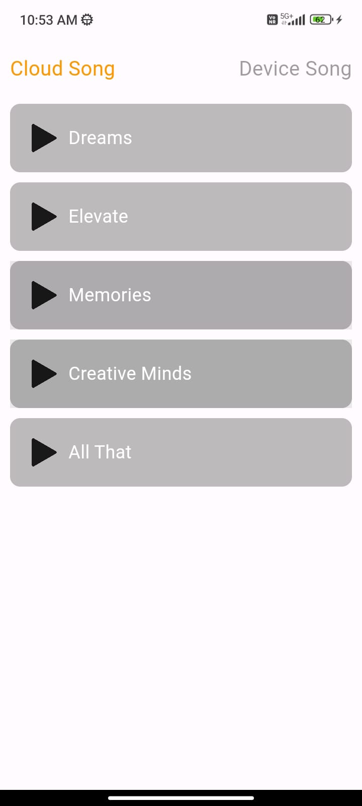 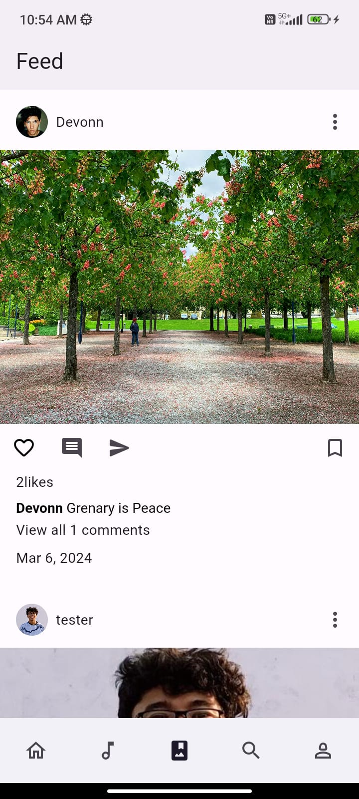 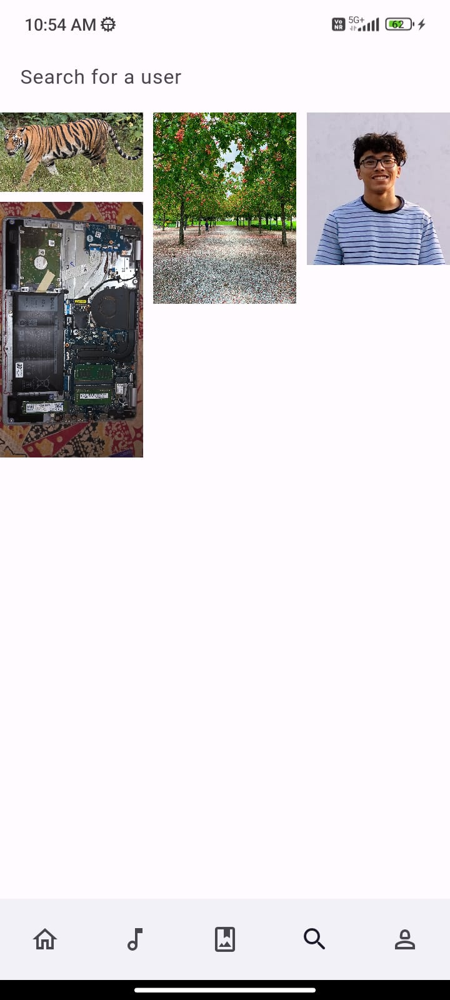 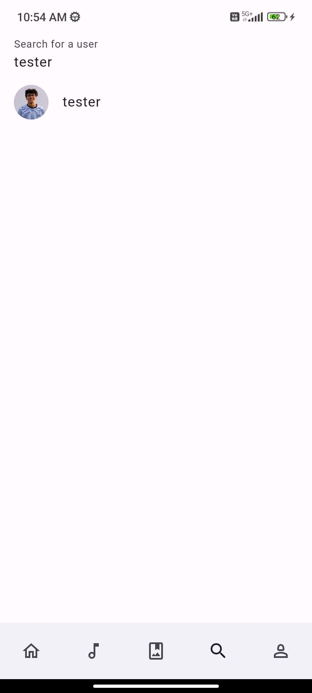 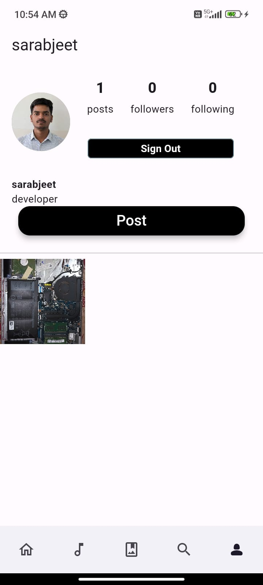 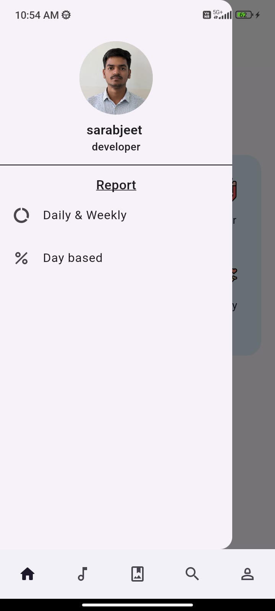 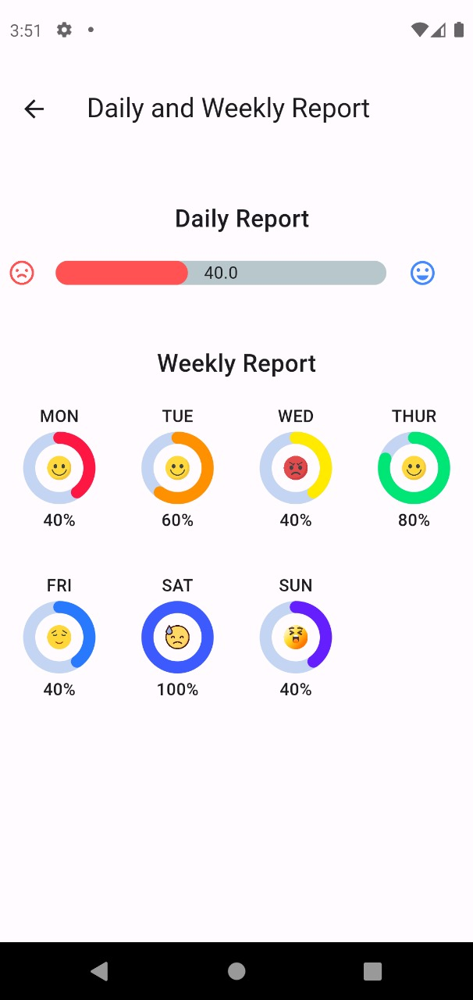 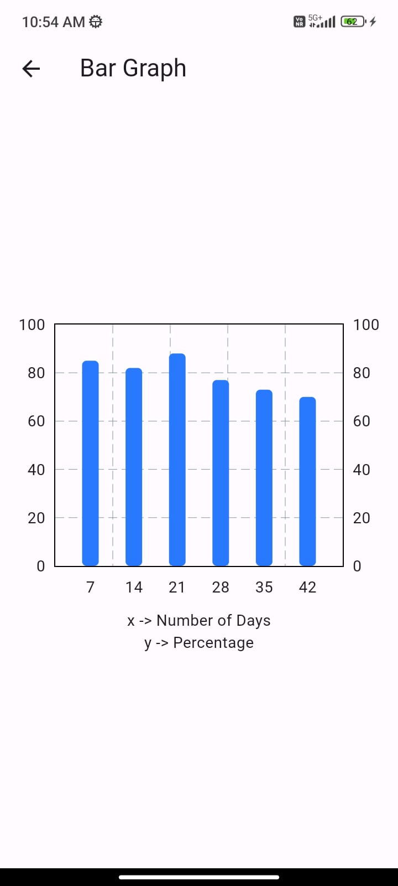

## Project Partner
**Name**: Rahul Mandal
[github account](https://github.com/rahulmandal112)

